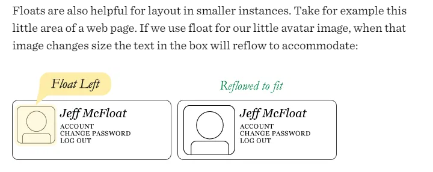
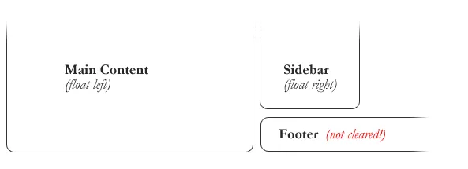
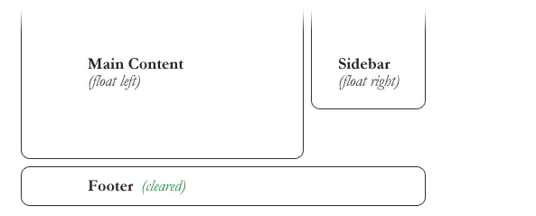
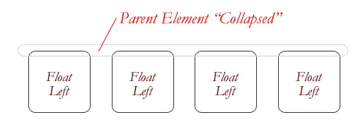

# Responsive Web Design

## **Responsive Web Design**

### Is the practice of building a website suitable to work on every device and every screen size, no matter how large or small, mobile or desktop.

## Responsive vs. Adaptive vs. Mobile

### _Responsive_: Generally means to react quickly and positively to any change,

### _Adaptive_: means to be easily modified for a new purpose or situation, such as change.

### _Mobile_ : Generally means to build a separate website commonly on a new domain solely for mobile users.

## Flexible Layouts

### Responsive web design is broken down into three main components:

-1 flexible layouts
-2 media queries
-3 flexible media

## Ethan Formula

### target ÷ context = result

## Media Queries

### Media queries provide the ability to specify different styles for individual browser and device circumstances.

### Initializing Media Queries

#### There are a couple different ways to use media queries, using the @media rule inside of an existing style sheet, importing a new style sheet using the @import rule, or by linking to a separate style sheet from within the HTML document. Generally speaking it is recommend to use the @media rule inside of an existing style sheet to avoid any additional HTTP requests.

## Identifying Breakpoints

### Your instinct might be to write media query breakpoints around common viewport sizes as determined by different device resolutions, such as 320px, 480px, 768px, 1024px, 1224px, and so forth. This is a bad idea.

### When building a responsive website it should adjust to an array of different viewport sizes, regardless of the device. Breakpoints should only be introduced when a website starts to break, look weird, or the experience is being hampered.

### Additionally, new devices and resolutions are being released all of the time. Trying to keep up with these changes could be an endless process.

> We should start the design for mobile first

---

# Float

## What is “Float”?

### _Float_ is a CSS positioning property

## What are floats used for?

### floats can be used to create entire web layouts.

## Clearing the Float

### Float’s sister property is **clear**.

- At the below photo the sidebar is floated to the right and is shorter than the main content area. The footer then is required to jump up into that available space as is required by the float.

- To fix this problem, the footer can be cleared to ensure it stays beneath both floated columns.

## The Great Collapse

### One of the more bewildering things about working with floats is how they can affect the element that contains them (their “parent” element). If this parent element contained nothing but floated elements, the height of it would literally collapse to nothing. This isn’t always obvious if the parent doesn’t contain any visually noticeable background, but it is important to be aware of.

## Techniques for Clearing Floats

1 - **The Empty Div Method** : `

`
2 - **The Overflow Method** : relies on setting the overflow CSS property on a parent element. If this property is set to auto or hidden on the parent element, the parent will expand to contain the floats, effectively clearing it for succeeding elements.
3 - **The Easy Clearing Method** : uses a clever CSS pseudo selector (:after) to clear floats. Rather than setting the overflow on the parent, you apply an additional class like “clearfix” to it. Then apply this CSS:
`.clearfix:after { content: "."; visibility: hidden; display: block; height: 0; clear: both; }`

## Problems with Floats

1 - **Pushdown** : is a symptom of an element inside a floated item being wider than the float itself (typically an image). Most browsers will render the image outside the float.

- **_Quick fix_**: Make sure you don’t have any images that do this, use overflow: hidden to cut off excess.
  2 - **Double Margin Bug** : Another thing to remember when dealing with IE 6 is that if you apply a margin in the same direction as the float, it will double the margin.
- **_Quick fix_**: set display: inline on the float, and don’t worry it will remain a block-level element.
  3 - The **3px Jog**: The 3px Jog is when text that is up next to a floated element is mysteriously kicked away by 3px like a weird forcefield around the float.
- **_Quick fix_**: set a width or height on the affected text.
  4 - **In IE 7, the Bottom Margin Bug**: is when if a floated parent has floated children inside it, bottom margin on those children is ignored by the parent
- **_Quick fix_**: using bottom padding on the parent instead.

---

# Resources

[Responsive Web Design](https://learn.shayhowe.com/advanced-html-css/responsive-web-design/)  
[All About Floats](https://css-tricks.com/all-about-floats/)
