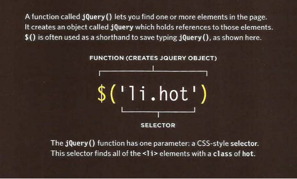
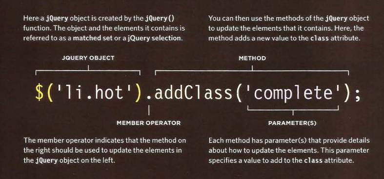
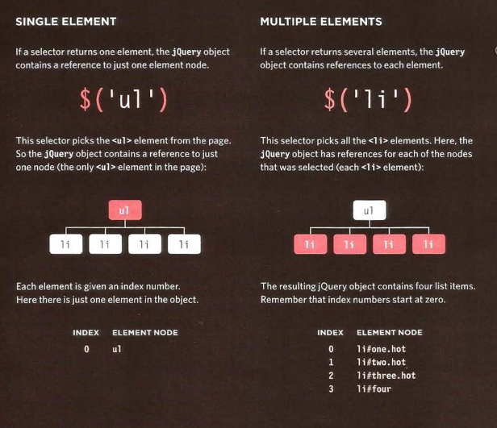
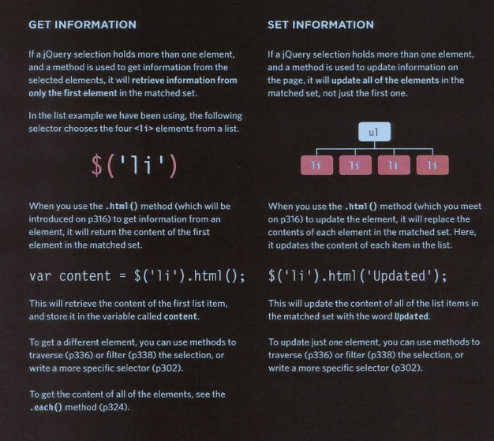
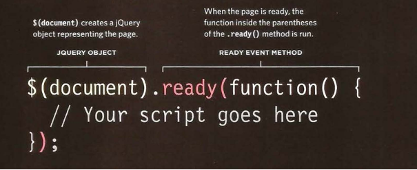
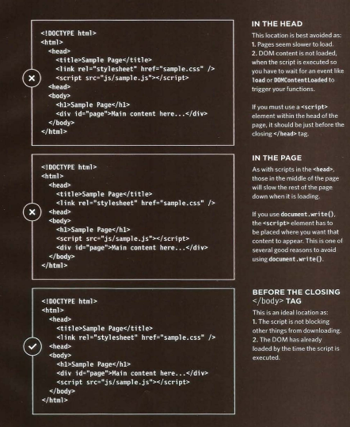
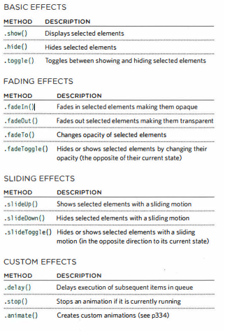

# Chapter 7: jQuery

## jQuery offers a simple way to achieve a variety of common JavaScript tasks quickly and consistently, across all major browsers and without any fallback code needed.

## What is jQuery ??

### jQuery is a JavaScript file that you include in your we pagws.it lets you find elements using CSS-style selectors and then do somthing with the elements using jQuery methods.

## How to find elements using CSS-Style selectors?

## How to do something with the elements using jQuery methods?

## WHY USE JQUERY?

1 - SIMPLE SELECTORS
2- COMMON TASKS IN LESS CODE
3- CROSS-BROWSER COMPATIBILITY

> jQuery's motto is " **Write less, do more,**" because it allows you to achieve the same goals but in fewer lines of code than you would need to write with plain JavaScript.

## A matched set/ jQuery selection

### When you select one or more elements, a jQuery object is returnd. It is also known as a matched set or a jQuery selection.

## jQuery methods that get and set data

### Some jQuery methods both retrieve information from, and update the contents ofelements, But they do not always apply to all elements.

## Checking a pages is ready to work with

### jQuery .redy() method check that the page is ready for your code to work with.

## UPDATING ELEMENTS

- .html() : get the html tag
- .text() : get the content inside the tag
- .replaceWith() : replace the element tag
- .remove() : remove the element

## INSERTING ELEMENTS

- Create the new elements in a jQuery object
  - for example `var $newFragment = $('<li>');`
- ADDING THE NEW ELEMENTS TO THE PAGE by
  - .before()
  - .after()
  - .prepend()
  - .append()

## WHERE TO PLACE YOUR SCRIPTS

## Effects

