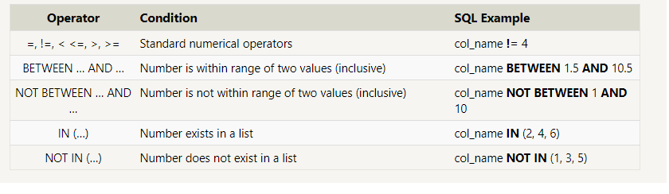

# SQL

## SQl: Structured Query Language

## What is SQL?

- It's a language designed to manipulate and transform data from a relational database.

## What is Relational database?

- Represents a collection of related (two-dimensional) tables with a fixed number of named columns.

## Select queries 101

- `SELECT column FROM mytable;` ---> in this code we select **ONE** column from a table called _mytable_
- `SELECT * FROM mytable;` ---> this code select **all** the columns from the table called _mytable_

## Queries with constraints

- To filter results and return specific results we should use **WHERE** clause.
- `SELECT column, another_column, … FROM mytable WHERE condition AND/OR another_condition AND/OR …;`
  In this example we can selesct specific results
- 
